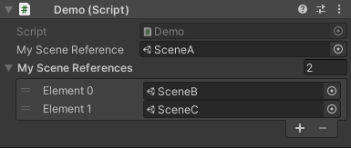
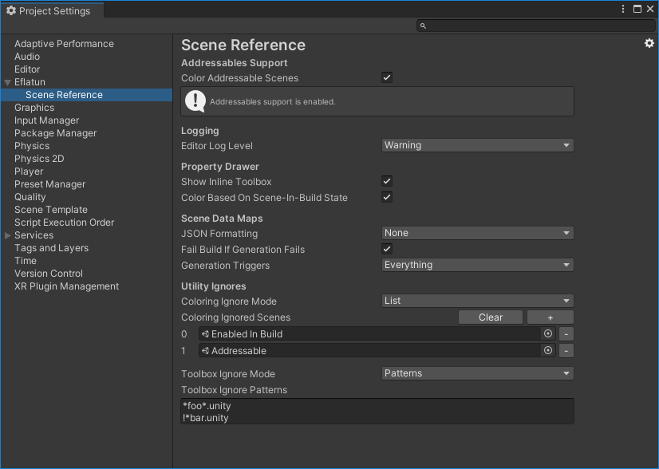

<h1 align="center">Eflatun.SceneReference</h1>
<br>

<p align="center">
    
</p>
<br>

<p align="center">
    Scene References for Runtime and Editor.
</p>

<p align="center">
    Strongly typed, robust, and reliable.
</p>

<p align="center">
    Provides Asset GUID, Scene Path, Build Index, and Scene Name.
</p>
<br>

<p align="center">
  <a href="https://github.com/starikcetin/Eflatun.SceneReference/"></a>
  &nbsp;
  <a href="https://openupm.com/packages/com.eflatun.scenereference/"></a>
</p>
<br>

# Installation

## With OpenUPM (recommended)

1. Install OpenUPM via npm. Skip this step if already have OpenUPM installed.

```
npm install -g openupm-cli
```

2. Install `com.eflatun.scenereference` in your project. **Make sure to run this command at the root of your Unity project.**

```
openupm add com.eflatun.scenereference
```

## With Git URL

Add the following line to the `dependencies` section of your project's `manifest.json` file. Replace `1.0.0` with the version you want to install.

```
"com.eflatun.scenereference": "git+https://github.com/starikcetin/Eflatun.SceneReference.git?#1.0.0"
```

_Although it is highly discouraged, you can replace `1.0.0` with `upm` to get the latest version instead of a specific one._

# Usage

1. Define your `SceneReference` serialized field:

```cs
// Import Runtime namespace
using Eflatun.SceneReference;

// You can define it by itself
[SerializeField] private SceneReference mySceneReference;

// Or in a collection
[SerializeField] private List<SceneReference> mySceneReferences;
```

2. Assign your scene to your `SceneReference` field in the inspector:



3. Use it!

```cs
// Import Runtime namespace
using Eflatun.SceneReference;

// You can access these anytime, anywhere
var sceneGuid = mySceneReference.AssetGuidHex;
var scenePath = mySceneReference.ScenePath;
var sceneBuildIndex = mySceneReference.BuildIndex;
var sceneName = mySceneReference.Name;

// You can only access these when the scene is currently loaded
var loadedScene = mySceneReference.LoadedScene
```

# Settings

`Eflatun.SceneReference` provides settings under the `Project Settings`.

Open the project settings via `Edit/Project Settings...` menu item.

Look for the `Eflatun` category in the left panel. Select the `Scene Reference` item.



## Generation Triggers

Controls when the Scene GUID to Path Map gets regenerated.

- After Scene Asset Change: Regenerate the map every time a scene asset changes (delete, create, move, rename).

- Before Enter Play Mode: Regenerate the map before entering play mode in the editor.

- Before Build: Regenerate the map before a build.

It is recommended that you leave this option at _All_ unless you are debugging something. Failure to generate the map when needed can result in broken scene references in runtime.

## JSON Formatting

Controls the Scene GUID to Path Map Generator's JSON formatting.

It is recommended to leave this option at _Indented_, as it will help with version control and make the generated file human-readable.

## Fail Build If Generation Fails

Should we fail a build if scene GUID to path map generation fails?

Only relevant if _Before Build_ generation trigger is enabled.

It is recommended to leave this option at _true_, as a failed map generation can result in broken scene references in runtime.

# Advanced Usage

## Generated File

`Eflatun.SceneReference` uses a JSON generator in editor-time to produce a `Scene GUID -> Scene Path` map. You can find the file at this location: `Assets/Resources/Eflatun/SceneReference/SceneGuidToPathMap.generated`.

**This file is auto-generated, do not edit it. Any edits will be lost at the next generation.**

## Running the Generator Manually

The generator runs automatically according to the triggers selected in the settings. However, if for some reason you need to run the generator yourself, you can do so. 

Running the generator has no side-effects.

### Via Menu Item

You can trigger the generator via a menu item. Find it under `Eflatun/Scene Reference/Run Scene GUID to Path Map Generator`:


### In Editor Code

You can trigger the generator from your editor code:

```cs
// Import Editor namespace
using Eflatun.SceneReference.Editor;

// Run the generator. Only do this in Editor code!
SceneGuidToPathMapGenerator.Run();
```

## Accessing Settings in Editor Code

You can read and manipulate `Eflatun.SceneReference` settings from your editor code.

**Changing the settings from code may have unintended consequences. Make sure you now what you are doing.**

```cs
// Import the Editor namespace
using Eflatun.SceneReference.Editor;

// Access a setting. Only do this in Editor code!
var generationTriggers = SettingsManager.SceneGuidToPathMap.GenerationTriggers;

// Change a setting. Only do this in Editor code!
SettingsManager.SceneGuidToPathMap.GenerationTriggers = GenerationTriggers.All;
```

# Caveats

`Eflatun.SceneReference` provides you with the information it has no matter what. It doesn't do any validation on whether the scene is in the build (_yet! this is a planned feature_). If your scene is not added to Build Settings or it is not enabled, you won't be able to load it, as Unity only bundles the scenes added and enabled in Build Settings.

# Acknowlegments

* This project is inspired by [JohannesMP's SceneReference](https://github.com/JohannesMP/unity-scene-reference). For many years I have used his original implementation of a runtime Scene Reference. Many thanks [@JohannesMP](https://github.com/JohannesMP) for saving me countless hours of debugging, and inspiring me to come up with a more robust way to tackle this problem that Unity refuses to solve.

* README header inspired by [Angular's README](https://github.com/angular/angular).

# License

MIT License. Refer to the [LICENSE](LICENSE) file.

Copyright (c) 2022 [S. Tarık Çetin](https://github.com/starikcetin)
